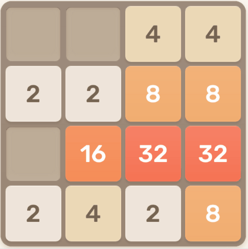

  

    
  

  

    
  

###

# 2048 Solver - GoPy

A high-performance hybrid AI that solves the 2048 puzzle in real-time. It combines a Go-based search engine for raw speed with a Python-based computer vision wrapper for seamless browser interaction.

## How It Works

`Vision`: Python uses OpenCV and `pyautogui` to locate the game board via a `template.png` anchor.

`Analysis`: The script samples RGB values from the grid to identify tile values based on their distinct colors.

`Brain`: The board state is sent as JSON to a compiled Go binary for processing.

`Search`: The Go engine runs a minimax-style search using a heuristic that favors monotonicity and "Snake" weight patterns.

`Action`: Python receives the optimal move and executes it using `pydirectinput` to simulate hardware-level keystrokes.

## Project Structure

| File | Description |
| :--- | :--- |
| `main.go` | Entry point for the Go engine; handles CLI arguments and JSON IPC. |
| `internalgame/` | Core game logic, move simulation, and AI heuristics. |
| `main.py` | The Python controller managing screen capture, vision, and input. |
| `requirements.txt` | List of necessary Python dependencies. |

## Installation & Setup

### 1. Build the Go Engine
Ensure you have Go installed on your system:
`go build -o 2048_ai.exe cmd/cli-tool/main.go`

### 2. Install Python Dependencies
`pip install -r requirements.txt`

### 3. Prepare the Template
Take a small screenshot (approx. 50x50px) of the top-left empty corner of the 2048 board (the brown background) and save it as `template.png` in the root folder.

### 4. Run the Solver
Open play2048.co in your browser, then launch the script:
`python main.py`

## Configuration

You can tweak the performance via CLI arguments or by modifying the `main.py` call:

    `--depth`: Increase the search depth for better moves. Higher depth = smarter play but slower turns (Recommended: 7-9).

    `--grid`: Used primarily for debugging; allows you to pass a manual JSON string directly to `2048_ai.exe`.

---

### Project Disclaimer

This project is developed for learning purposes to demonstrate the integration of Go and Python using inter-process communication (IPC) and computer vision.

The author does not condone the use of this software for cheating in competitive environments, online leaderboards, or any platform where automation is prohibited by the terms of service.

Ethical Use: Users are encouraged to use this code to study search heuristics and automation techniques rather than to gain an unfair advantage in gaming communities.

Responsibility: The user assumes all responsibility for how this tool is applied and for ensuring compliance with the rules of any website or service they interact with.